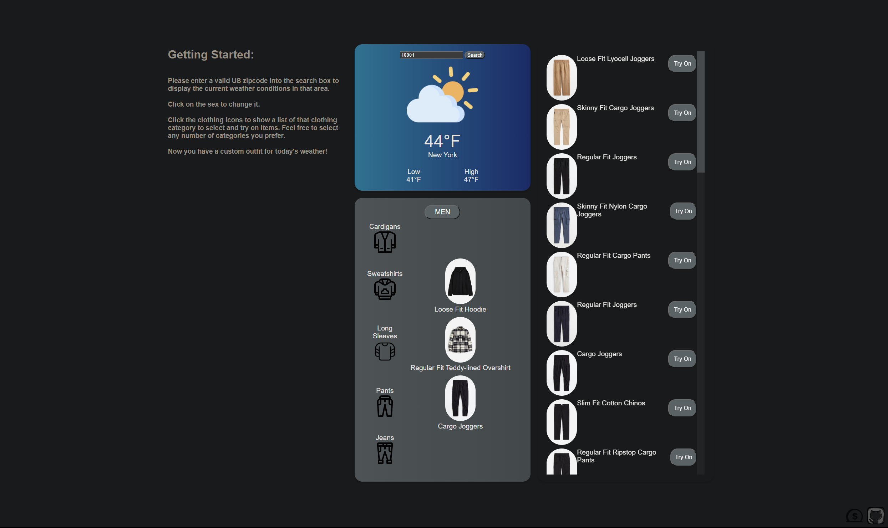

# Outfitter

<a href="https://inkorrect-code.github.io/Outfitter/">Outfitter</a> is a JavaScript-based data visualization that assists the user in coordinating outfits based on the weather conditions of a desired location. Geolocation is used to default to the user's current location, and further allows input of any valid US zip code to choose a different location. From this point, a sex is specified and appropriate clothing categories will be available to select, allowing the user to pick specific clothing items of various styles from the list that appears.



## Instructions
Please enter a valid US zipcode into the search box to display the current weather conditions in that area.

Click on the sex to change it.

Click the clothing icons to show a list of that clothing category to select and try on items. Feel free to select any number of categories you prefer.

Now you have a custom outfit for today's weather!

## Wireframe


## Features
- Fetches real-time weather data based on user's location or input.

    ```javascript
    getWeatherDataFromAPI(locationData) {
        const apiKey = '5a5417f25c205e05f2bbfd938f406cb4';
        let url = `http://api.openweathermap.org/data/2.5/weather?appid=${apiKey}&units=imperial`;
        if (locationData.lat !== undefined && locationData.lon !== undefined) url += `&lat=${locationData.lat}&lon=${locationData.lon}`
        else url += `&zip=${locationData.zipCode},${locationData.countryCode}`

        fetch(url)
        .then(response => response.json())
        .then(weatherData => { 
            
            this.displayWeatherData(weatherData)

            const categories = this.getCategories(weatherData)
            this.outfitRenderer.displayCategories(categories)
        })
        .catch(error => console.error('Error:', error));
    }

    ```
- Suggests appropriate clothing categories based on the current weather.

    ```javascript
    getCategories(weatherData) {
    
        const mensCategories = [];
        const womensCategories = [];

        const temperature = weatherData.main.temp;

        if (temperature <= 40) {
        mensCategories.push('men_jacketscoats', 'men_hoodiessweatshirts', 'men_shirts', 'men_trousers', 'men_jeans')
        womensCategories.push('ladies_jacketscoats', 'ladies_hoodiessweatshirts', 'ladies_trousers', 'ladies_jeans')

        } else if (temperature > 40 && temperature <= 60) {
        mensCategories.push('men_cardigansjumpers', 'men_hoodiessweatshirts', 'men_shirts', 'men_trousers', 'men_jeans')
        womensCategories.push('ladies_cardigansjumpers', 'ladies_hoodiessweatshirts', 'ladies_tops', 'ladies_shirtsblouses', 'ladies_trousers', 'ladies_jeans', 'ladies_dresses')

        } else if (temperature > 60 && temperature <= 70) {
        mensCategories.push('men_shirts', 'men_tshirtstanks', 'men_shorts', 'men_trousers', 'men_jeans')
        womensCategories.push('ladies_tops', 'ladies_shirtsblouses', 'ladies_trousers', 'ladies_jeans', 'ladies_skirts', 'ladies_dresses')

        } else {
        mensCategories.push('men_tshirtstanks', 'men_shorts')
        womensCategories.push('ladies_tops', 'ladies_shirtsblouses', 'ladies_skirts', 'ladies_shorts', 'ladies_dresses')

        }
        return {men: mensCategories, women: womensCategories};
  }
    ```
- Fetches real clothing items for the user to pick for each desired clothing category.

    ```javascript
    displayClothingItem(clothingItem) {
        const clothingElem = document.createElement('li')
        clothingElem.classList.add('clothing-item')
        document.getElementById('clothing-list').appendChild(clothingElem)

        const clothingImgElem = document.createElement('img')
        clothingImgElem.classList.add('clothing-img')
        clothingImgElem.src = clothingItem.images?.length > 0 ? clothingItem.images[0].url : ''
        clothingElem.appendChild(clothingImgElem)

        const clothingTextElem = document.createElement('div')
        clothingTextElem.classList.add('clothing-text')
        clothingTextElem.innerText = clothingItem.name
        clothingElem.appendChild(clothingTextElem)

        const clothingButtonElem = document.createElement('button')
        clothingButtonElem.classList.add('clothing-button')
        clothingButtonElem.innerText = 'Try On'
        clothingButtonElem.addEventListener('click', () => {
            this.outfitRenderer.addClothingItem(this.category, clothingItem)
        })
        clothingElem.appendChild(clothingButtonElem)
    }
    ```
- Allows users to switch between men's and women's clothing suggestions.

    ```javascript
    initEventListeners() {
        document.getElementById('toggle-button').addEventListener('click', () => {
            this.displayedCategories = this.displayedCategories === 'men' ? 'women' : 'men'
            document.getElementById('toggle-button').innerText = this.displayedCategories.toUpperCase()
            this.displayCategories(this.categories)
        })
    }
    ```

## Technologies, Libraries, and APIs:
- [The One Call API 3.0] [https://openweathermap.org/api/one-call-3] for real-time weather information.
- [HM - Hennes Mauritz API] [https://rapidapi.com/apidojo/api/hm-hennes-mauritz] for retrieving clothing items to select.
- Webpack to bundle and transpile the source Javascript code.

## Setup and Installation
1. Clone the repository to your local machine.
2. Navigate to the project directory.
3. Run `npm install` to install all the dependencies.
4. Run `npm start` to start the development server.
5. Open your browser and navigate to `http://localhost:8080/` (or the port number shown in your terminal).

## Future Improvements
- Add more clothing categories and options, such as accessories.
- Improve the user interface and experience.
- Add user accounts and save preferred outfits.
- Add a visual mannequin to display clothing categories selected.
- Add more weather information such as humidity and wind patterns.
- Add option to remove selected items, not just replace them.
- Remove repetetive categories when one is selected (e.g. jeans category disappears if pants are selected).

## Contributing
Pull requests are welcome. For major changes, please open an issue first to discuss what you would like to change.
